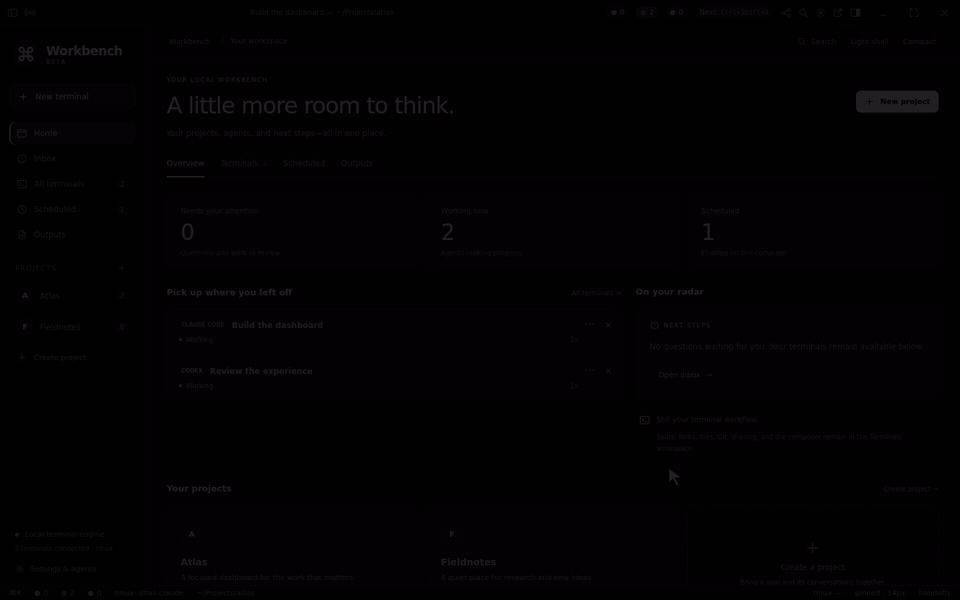

# Workbench Classic

> An open-source snapshot of Workbench **1.0.3-beta.2** (September 5, 2026): the
> vanilla desktop app with its core features. It is not actively developed;
> issues and pull requests are welcome but may not get a quick reply.

### Your agents. One workspace.

Run Claude Code and Codex side by side. See what needs your attention, follow
the work, and preview what your agents create—all in one desktop app.



*Actual Workbench Beta UI, presented in monochrome. Session content and generated page are illustrative.*

[Watch the walkthrough](docs/media/workbench.mp4) · [Setup and user guide](docs/guide.md) · [Windows setup](docs/windows-native-prototype-setup.md)

## Keep the work in view

- **Know where you’re needed.** Sessions are grouped by waiting, working, and ready for review.
- **Give each task room.** Resize panels, split panes, and send a prompt to one agent or a project.
- **Review what you’re building.** Preview pages and documents, inspect diffs, and stage changes beside the agent.
- **Share a project folder.** [Sync saved files privately through GitHub](docs/project-sync.md), with a review before sharing.
- **Pick up where you left off.** The underlying terminal sessions keep running when the window closes.

## Try it

**[Download Workbench 1.0.3-beta.2](https://github.com/keeganarko/workbench-classic/releases/tag/v1.0.3-beta.2)** for Mac (Apple silicon or Intel) and Windows (Intel/AMD or ARM).
In this Beta, choose **Updates → Update and restart** to download, install,
and reopen the app. Older builds with **Show installer** need this installer
once to gain the new behavior. Your projects and preferences stay outside the
app. See [updates](docs/updater-design.md) for installation requirements.

Workbench is in beta. One `main` branch builds both the Mac and Windows apps.
The installers are unsigned, so macOS Gatekeeper and Windows SmartScreen will
ask you to confirm the first launch.

You’ll need Node.js 22.16+ or 24+, `tmux`, and Claude Code or Codex installed and signed in.

### macOS

```sh
brew install node tmux
git clone https://github.com/keeganarko/workbench-classic.git
cd workbench-classic
npm ci
npm run dev
```

### Windows

The native desktop app uses Ubuntu on WSL 2 for tmux and the coding agents.
Install Node.js and Git on Windows, then follow the [Windows setup guide](docs/windows-native-prototype-setup.md):

```powershell
git clone https://github.com/keeganarko/workbench-classic.git
cd workbench-classic
npm ci
npm run verify
npm run dist:win
```

The [WSLg guide](docs/windows-wslg.md) covers running the Linux window instead.

## Make your first workspace

1. Create a project and choose its default folder; opening it takes you to Terminals.
2. Choose an assistant, or start both side by side.
3. Give it a task. Open the preview to inspect its output as you work.

The composer targets **This Pane**, **This Project**, or **All Sessions**. A
confirmed [Session Bus manager](docs/session-bus.md) can coordinate the agents
in its project. An explicitly granted App Manager can coordinate across projects.
Use Focus to see project progress, reported milestones, and what needs you;
open a terminal or output when you want the details.
Outputs retain their project of origin. Scheduled tasks run
while Workbench is open.

Use **Services** to save local server commands, start or stop them, and read
recent output. Services stop when Workbench quits; starting with the app is
optional. Use the preview’s **Open**, **Save a copy**, **Show in folder**, and
**Drag file** controls to use generated files elsewhere. Open **Permissions**
to review agent access.

## Develop

```sh
npm run verify
```

Runs type checks, the build, and tests. More on [agents](docs/agents.md),
[previews](docs/preview.md), and [the full workflow](docs/guide.md).

## Credits

Created by [Keegan Choudhury](https://github.com/keeganarko), with contributions
from [hiteshsv1](https://github.com/hiteshsv1). Built with Electron, React,
TypeScript, xterm.js, and tmux.

[MIT License](LICENSE)
